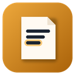

# Doceru PDF Finder



Extensão para Chrome (e outros navegadores baseados em Chromium) que lê o
atributo `data-pdf-url` nas páginas de livro do [doceru.com](https://doceru.com/)
e mostra o link do PDF direto no ícone da barra de ferramentas — sem precisar
abrir o DevTools pra caçar o valor manualmente.

<br clear="left" />

## Como funciona

O link do PDF só existe na página depois que **você** clica manualmente na
verificação de robô do doceru e o preview do PDF termina de carregar. A
extensão não pula nem acelera essa etapa: ela só fica perguntando, em segundo
plano, se o link já apareceu.

1. Abra um livro em `doceru.com` e clique na verificação de robô normalmente.
2. Clique no ícone da extensão.
3. Enquanto o popup estiver aberto, ele consulta a página a cada 1,5s e mostra
   "PDF ainda não carregou" até o preview terminar de carregar.
4. Assim que o link aparecer, o popup mostra a URL com botões para **copiar**
   ou **abrir o PDF** em uma nova aba.

## Instalar

A extensão não está publicada na Chrome Web Store — ela é carregada localmente
em "modo desenvolvedor". Isso funciona igual em **qualquer sistema operacional
de computador** (Windows, macOS ou Linux) e em **qualquer navegador baseado em
Chromium** (Chrome, Edge, Brave, Opera, Vivaldi...).

### 1. Baixe o código

Com o [Git](https://git-scm.com/downloads) instalado:

```bash
git clone https://github.com/eltobsjr/doceru-pdf-finder.git
```

Ou, sem usar Git: nesta página do GitHub, clique em **Code → Download ZIP** e
descompacte a pasta em qualquer lugar do computador.

### 2. Carregue no navegador

| Navegador | Endereço para colar na barra |
|---|---|
| Chrome | `chrome://extensions` |
| Edge | `edge://extensions` |
| Brave | `brave://extensions` |
| Opera | `opera://extensions` |

Passos (iguais em Windows, macOS e Linux):

1. Cole o endereço do navegador acima e aperte Enter.
2. Ative **Modo do desenvolvedor** (canto superior direito da página).
3. Clique em **Carregar sem compactação** (*Load unpacked*).
4. Selecione a pasta `doceru-pdf-finder` que você baixou/clonou.
5. O ícone da extensão aparece na barra de ferramentas — pode fixá-lo
   clicando no ícone de peça de quebra-cabeça 🧩 ao lado da barra de endereço.

Pronto — a extensão fica instalada localmente nesse navegador. Como não veio
da Chrome Web Store, o navegador não atualiza ela sozinha: para atualizar, dê
`git pull` (ou baixe o ZIP de novo) e clique em **Atualizar/Reload** na página
`chrome://extensions`.

### No Mac, especificamente

Mesmo passo a passo acima, no Chrome do macOS: `chrome://extensions` →
ativar **Modo do desenvolvedor** → **Carregar sem compactação** → selecionar a
pasta. Não precisa de nenhuma permissão especial do macOS para isso.

### Celular / tablet

Extensões de Chrome **não funcionam no Chrome do Android nem no Chrome/Safari
do iOS/iPadOS** — a Google e a Apple não permitem isso nesses apps. Se quiser
usar em um Android, uma alternativa é o [Kiwi
Browser](https://kiwibrowser.com/), que suporta carregar extensões
descompactadas do mesmo jeito que o Chrome de computador (menu → Extensions →
"+" → apontar para a pasta baixada). Em iOS/iPadOS não existe alternativa: a
Apple bloqueia esse tipo de extensão em qualquer navegador.

## Estrutura do projeto

```
manifest.json      configuração da extensão (Manifest V3)
content.js          roda dentro da aba do doceru.com e lê [data-pdf-url]
popup.html/.css/.js  janela que abre ao clicar no ícone
icons/               ícones em 16/32/48/128px
```

## Limitações atuais

- Só lê o primeiro elemento com `data-pdf-url` na página.
- Sem aviso (badge) antes de clicar no ícone — é preciso abrir o popup e
  deixá-lo aberto até o preview carregar.
- Só funciona em `doceru.com`.
